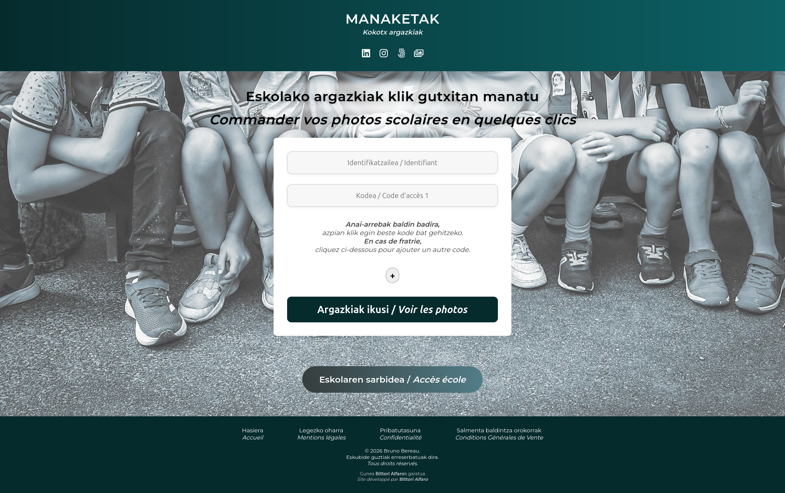
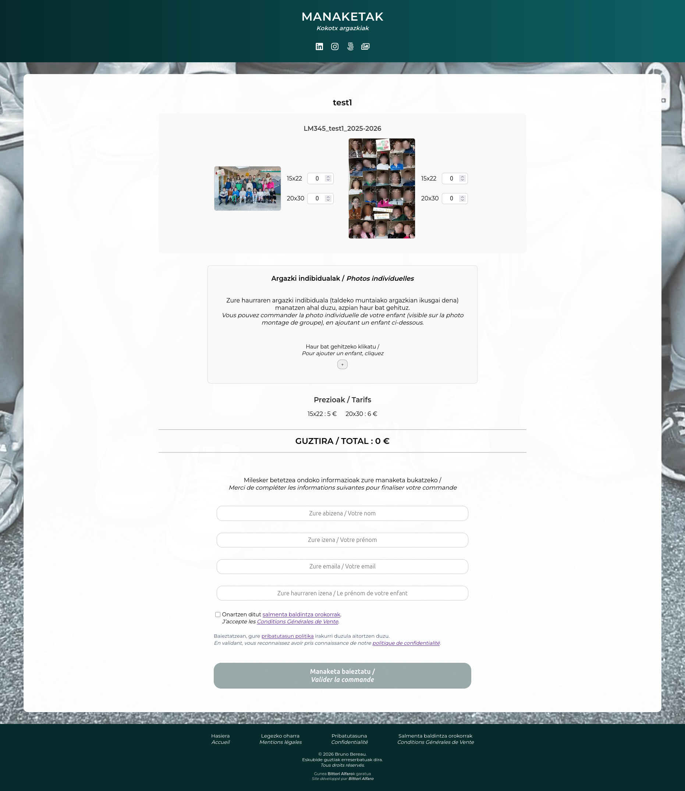
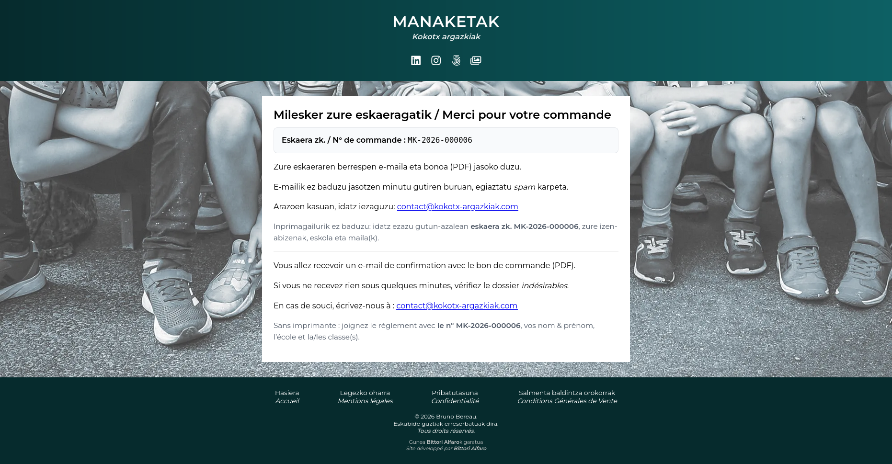
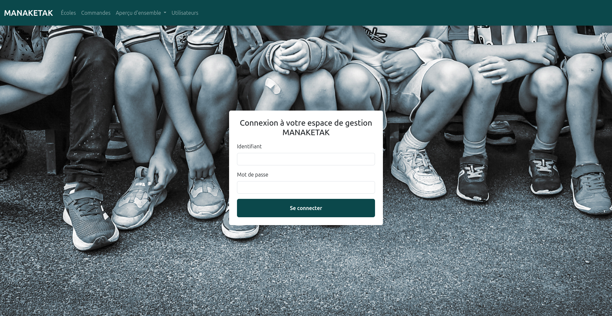
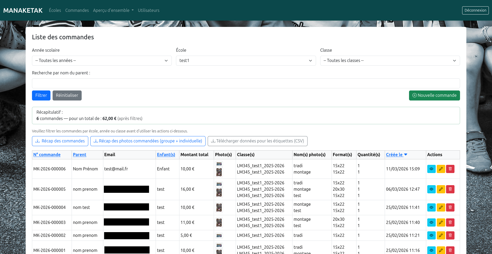
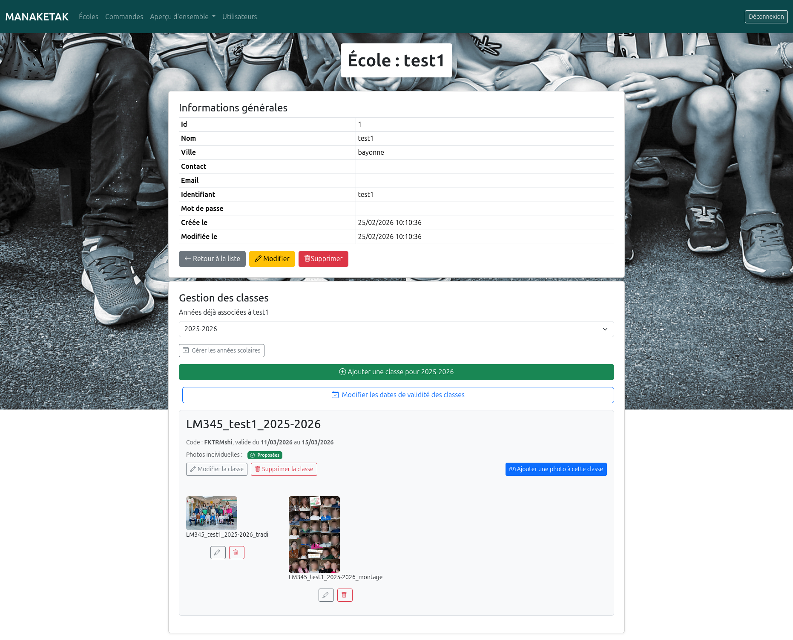

# Manaketak

Application web de gestion et de commande de photos scolaires.

Manaketak a été conçu pour répondre à des besoins métiers concrets liés à l’activité d’un photographe scolaire : gestion des écoles et des classes, accès sécurisé aux galeries, commandes de photos et suivi administratif.

Le projet a été imaginé, conçu et développé dans sa globalité, depuis l’analyse des besoins jusqu’au déploiement.

## Stack technique

### Backend
- Symfony
- API REST
- Doctrine
- MySQL

### Frontend
- Next.js
- React
- JavaScript

### Déploiement / infrastructure
- Vercel (frontend)
- Scalingo (backend)
- OVH Object Storage (stockage des photos)
- Git / GitHub

## Fonctionnalités principales

- gestion des écoles, classes et années scolaires
- accès sécurisé aux galeries photos pour les familles
- sélection et commande de photos individuelles et de groupe
- suivi des commandes côté backoffice
- génération automatique de bons de commande PDF
- export Excel pour le suivi et la préparation des commandes
- envoi d’e-mails transactionnels

## Architecture

Utilisateur  
↓  
Frontend Next.js (Vercel)  
↓  
API Symfony (Scalingo)  
↓  
Base de données MySQL  
↓  
Stockage photos (OVH Object Storage)

## Aperçu de l'application

### Accueil

### Galerie photos et commande

### Confirmation

### Login admin

### Suivi des commandes (backoffice)

### Gestion des écoles / classes

## Ce que ce projet m’a permis de travailler

- conception d’une application métier complète
- développement d’une API REST avec Symfony
- intégration frontend / backend avec Next.js
- gestion des rôles et des accès utilisateurs
- génération de documents PDF et exports Excel
- gestion et affichage de médias
- déploiement d’une architecture web séparée front / back / stockage
- résolution de problèmes de mise en production et d’exploitation

## Contexte de réalisation

Ce projet s’inscrit dans une logique de solution concrète, orientée usage et métier.  
Il est développé avec une attention particulière portée à la clarté de l’interface, à la fiabilité du fonctionnement et à la cohérence de l’architecture technique.

## Code source

Le code source complet n’est pas public.
Le projet étant destiné à un usage réel, seules une présentation fonctionnelle et des aperçus de l’application sont partagés ici.